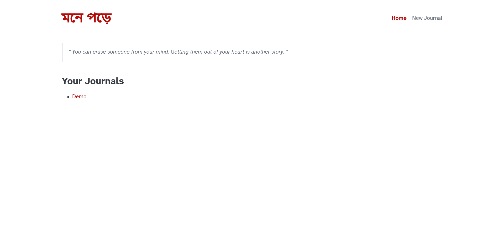
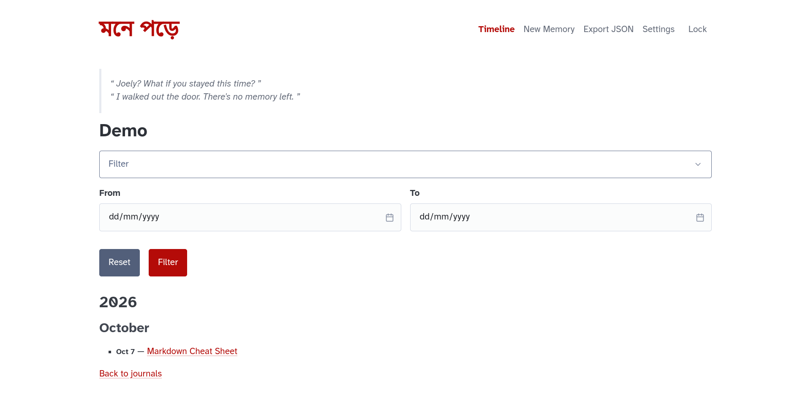
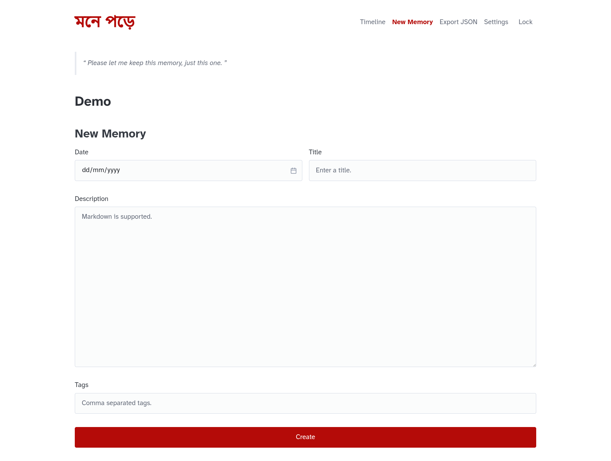
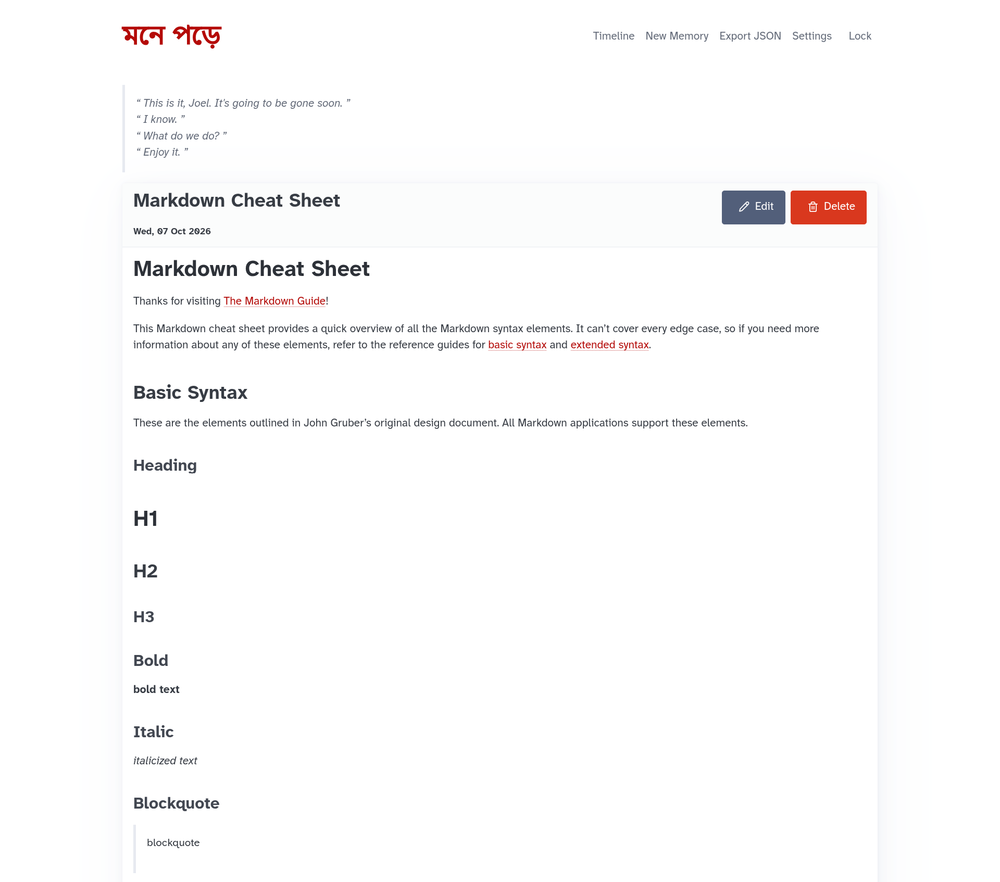

# Mone Pore - মনে পড়ে


[](LICENSE)

> A personal memory journal

_**Mone Pore**_ lets you jot down moments from any point in your life, be it today or years ago. Every memory has its own date, separate from when you decide to write it down, helping you build your own little box of memories.

It is a self-hosted Go web application designed to run on your own machine and be accessed through a web browser on your local network.
You can even run it on a Raspberry Pi like I do.

## Features

- Simple and easy to use interface.
- Password protection for journals to keep memories safe.
- Markdown support for memories.
- Separate memory date from writing date.
- Light and dark mode support based on system preferences.
- Export your journals to JSON format.

## Screenshots

|                            Home Page                             |                              Journal Overview                               |
| :--------------------------------------------------------------: | :-------------------------------------------------------------------------: |
|  |  |

|                               New Memory                                |                                View Memory                                |
| :---------------------------------------------------------------------: | :-----------------------------------------------------------------------: |
|  |  |

## Installation

You can download one of the prebuilt binaries for your platform [here](https://github.com/shsiddhant/mone-pore/releases).
The binary can be placed somewhere on your `PATH`.

## Usage

Mone Pore starts a web server listening on port 8080.

- **Local Access:** `http://localhost:8080`
- **Network Access:** `http://<host-address>:8080` (to access from other devices on the same network)

You can run the application either by directly executing the binary or by setting it up as a systemd service.

### Systemd Service (Recommended)

1. Place the provided [systemd unit file](https://github.com/shsiddhant/mone-pore/blob/main/mone-pore.service) inside `~/.config/systemd/user/`.
2. The service expects the binary to be located at `~/.local/bin/mone-pore`. If you want to place it somewhere else, modify the `ExecStart` path inside the unit file.
3. Start and enable the service to run on boot:

   ```shell
   systemctl --user enable --now mone-pore.service
   ```

## Updates

To update to a new version, replace the existing binary and restart the application.

For systemd installation (modify the binary location if needed):

```shell
install -m 755 mone-pore ~/.local/bin/mone-pore
systemctl --user restart mone-pore.service
```

## Development

Clone the repo:

```shell
git clone https://github.com/shsiddhant/mone-pore.git
```

### Run application

```shell
go run .
```

### Run tests

```shell
go test ./...
```

## License

This project is licensed under the [MIT License](LICENSE).
